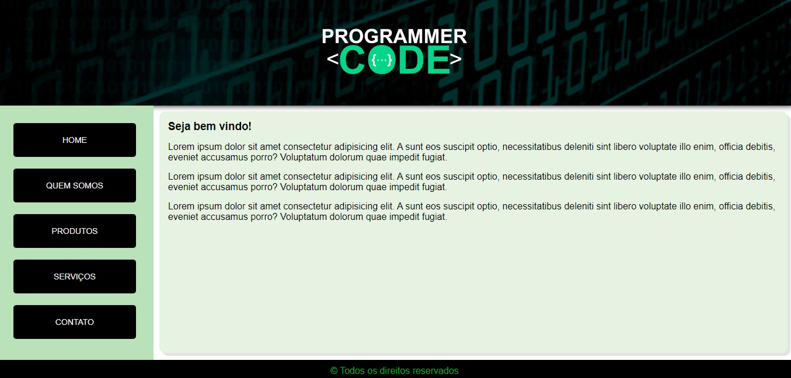

<h1> 📚 Layout Basic </h1>

Este projeto tem como objetivo apresentar conceitos intermediários de HTML e CSS, tais como a utilização de tags como Header, Section, Nav, Article e Footer, além da adição de páginas e o entendimento de Iframe.

O projeto também apresenta o uso de seletores e combinadores, além de text styles e propriedades como Visibility, Opacity e Display None, para melhorar a aparência e a interatividade do site.

Outros conceitos importantes, como Overflow, Pseudo-classes e Pseudo-elementos e as diferenças entre as posições fixed, absolute e relative também são abordados neste projeto.

O conhecimento adquirido com este projeto é fundamental para quem deseja se tornar um desenvolvedor web completo e criar sites mais avançados e interativos. Com a utilização das técnicas apresentadas aqui, é possível criar páginas mais atraentes e melhorar a experiência do usuário, além de entender melhor como funcionam as linguagens de programação web.

 

        

## 🤝 Faça sua Contribuição 

Esse repositório foi criado com o objetivo de estudar e aprimorar os conhecimentos em HTML5 e CSS3. Gostaría de convidá-los (as) a contribuir para o projeto, afinal, juntos podemos criar algo ainda melhor!

Caso tenha encontrado algo que tenha sido útil para você, ficarei muito feliz em saber que o meu trabalho está sendo útil para outras pessoas. Compartilhe também com seus amigos e conhecidos que possam se interessar pelo conteúdo.

Agradeço por sua visita e espero que possamos continuar a evoluir juntos!

 

> ## Se possível

    
- 🐛 Encontre e relate issues para que possamos corrigir eventuais bugs e melhorar a experiência do usuário. 

- ⭐️ Se gostou do nosso trabalho, por favor, considere dar uma estrela ao projeto. 

- 🤝 Sua contribuição é muito importante para nós e nos ajuda a continuar evoluindo. Agradecemos a sua visita e esperamos contar com a sua ajuda para tornar o projeto ainda melhor!

 

Desenvolvido 😜 por [Diego Moura dos Santos](https://www.linkedin.com/in/diegomouradossantos/).
